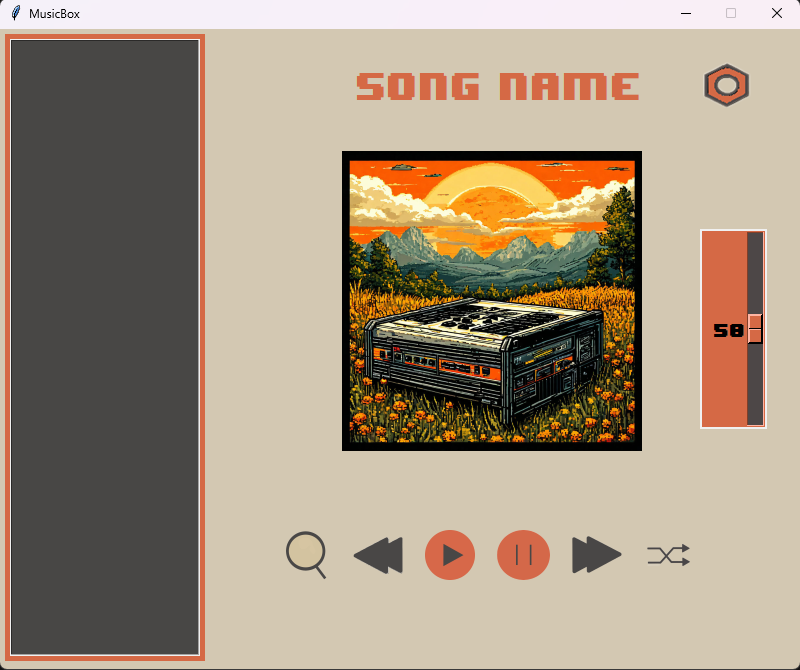

# MusicBox

MusicBox — это музыкальный плеер, разработанный на Python с использованием библиотеки Tkinter для графического интерфейса и Pygame для воспроизведения аудио. Приложение позволяет пользователям легко управлять своей музыкальной коллекцией, воспроизводить треки и настраивать внешний вид интерфейса с помощью различных тем.

## Основные функции

- **Управление плейлистом**: Добавление музыкальных файлов из выбранной папки и отображение их в списке.
- **Воспроизведение музыки**: Поддержка воспроизведения, паузы, перемотки вперед и назад, а также случайного воспроизведения треков.
- **Управление громкостью**: Регулировка уровня громкости с помощью слайдера.
- **Смена тем**: Возможность переключения между несколькими темами оформления интерфейса.

## Технологии

- **Python**: Основной язык программирования.
- **Tkinter**: Библиотека для создания графического интерфейса пользователя (GUI).
- **Pygame**: Библиотека для работы с мультимедиа, используемая для воспроизведения аудио.
- **PhotoImage**: Для загрузки изображений и иконок кнопок.

## Установка

1. Убедитесь, что у вас установлен Python (рекомендуется версия 3.6 и выше)
2. Установите необходимые библиотеки с помощью pip
3. Скачайте или клонируйте репозиторий
4. Перейдите в папку проекта
5. Запустите приложение

## Использование

-	Кнопка “Пауза”-позволяет остановить воспроизведение
-	Кнопка “Возобновить воспроизведение”-позволяет возобновить воспроизведение
-	Кнопка “Регулировки громкости”-позволяет увеличивает громкость при перемещении кнопки вверх, и уменьшать громкость при перемещении кнопки вниз
-	Кнопки “Перемещение треков вперед и назад”-позволяют перемещать треки вперёд и назад
-	Кнопка “Лупа”-позволяет найти трек на ПК и добавить в приложение
-	Кнопка “Перемещать все”-позволяет включить рандомный трек

## Скриншоты

